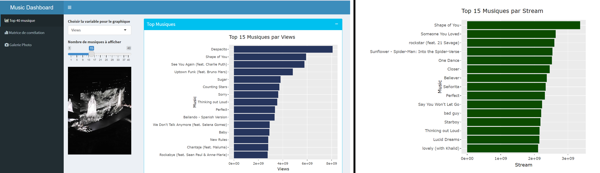
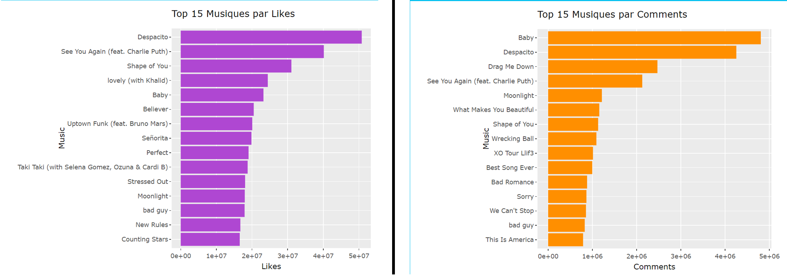
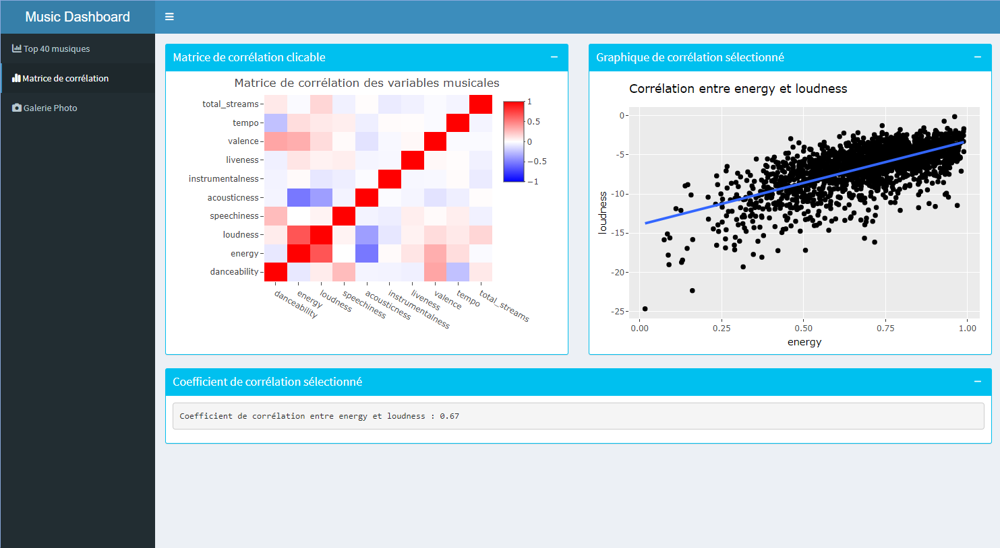

```{r setup, include=FALSE}
knitr::opts_chunk$set(
	echo = FALSE,
	message = FALSE,
	warning = FALSE
)
```
## Introduction ✨
L'équipe de projet `The World (Taylor's Version)` est composée de quatres personnes : Marielle CHARON, Kevin HERNANDEZ, Anouchka NEVEU et Amadou ISSAKA AMADOU. Le but de ce projet est de répondre à plusieurs questions sur le thème de la musique et plus précisement sur les platformes Spotify et Youtube grace à la visualisation de données. Le projet sera développé sous R.

## Données 💡
Le dataset utilisé (`Datasetfinal.csv`) est un merge de deux datasets : [Spotify and Youtube](https://www.kaggle.com/datasets/salvatorerastelli/spotify-and-youtube) et [Spotify songs](https://www.kaggle.com/datasets/sujaykapadnis/spotify-songs). Le merge final pèse 6.55 MB et est sous format CSV. Il contient 3668 éléments. La clé qui a servi au merge est l'ID de la musique sur Spotify.

Les deux jeux de données contiennent des données datant de **2023** collectées depuis les API officielles de YouTube et Spotify. On a, notamment, les 10 musiques les plus populaires d'une variété d'artistes.

> Il possède à l'heure actuelle 50 features, avant cleaning de celles pertinentes.
<br>
On regroupe les features sous ces catégories :
<br><br>

| Catégorie | Features associées |
| --- | --- |
| Informations générales | artist, track_name, album, album_type, duration_ms, channel, description, track_album_release_date, ... |
| Scores musicaux | danceability, energy, key, loudness, acousticness, instrumentalness, liveness, valence, tempo |
| Popularité | views, likes, comments, stream, track_popularity |
| Variables supplémentaires | uri (Spotify ID), url_spotify, url_youtube, licensed, ... |

> Les variables supplémentaires n'expliquent pas la donnée pour l'analyse, mais sont utilisées pour structurer le dataset.
<br>
Les features se répartissent selon plusieurs types : nominales (nom de l'artiste/musique/album, ...), discrètes (tonalité) ou continues (scores musicaux).

#### Features audio 🎵

Les features audio sont des données extraites des musiques elles-mêmes par l'API Spotify. Elles sont calculées par des algorithmes de traitement du signal audio. Ces algorithmes ne sont pas publics, mais voici ce que Spotify dit de ces features :


| Paramètre         | Intervalle | Description |
|-------------------|------------|-------------|
| danceability      | 0-1        | La danceability décrit à quel point une piste est adaptée à la danse en fonction de divers éléments musicaux (tempo, beats, régularité...). Plus la valeur est élevée, plus la piste est dansante |
| energy            | 0-1        | L'énergie est une mesure qui représente une mesure perceptuelle de l'intensité et de l'activité. Les pistes énergiques ont une intensité rapide et forte (par exemple, le death metal a une haute énergie). Les mesures perceptives utilisées comprennent la gamme dynamique, l'intensité sonore perçue, le timbre et l'entropie générale |
| instrumentalness  | 0-1        | Prédit si une piste ne contient aucun contenu vocal. Les sons "Ooh" et "aah" sont traités comme des instruments. Les pistes instrumentales sont souvent des pistes de musique classique ou de musique électronique |
| liveness          | 0-1        | Détecte la présence d'un public dans l'enregistrement. Les valeurs supérieures à 0,8 fournissent une forte probabilité que la piste soit un enregistrement en direct |
| loudness          | ~ -60-0    | L'intensité sonore globale d'une piste en décibels (dB). Les valeurs d'intensité sonore sont calculées en moyenne sur l'ensemble de la piste |
| speechiness       | 0-1        | Détecte la présence de mots parlés dans une piste. Plus la valeur est proche de 1, plus la piste est probablement entièrement constituée de mots parlés. Les valeurs supérieures à 0,66 décrivent des pistes qui sont probablement entièrement parlées. Les valeurs comprises entre 0,33 et 0,66 décrivent des pistes qui peuvent contenir à la fois de la musique et des paroles, soit en sections, soit en couches, y compris des cas tels que la musique rap. Les valeurs inférieures à 0,33 représentent très probablement de la musique et d'autres pistes ne ressemblant pas à des paroles |
| mode              | 0-1        | Le mode indique la modalité (majeure ou mineure) de la piste. Les pistes en mode majeur sonnent généralement plus joyeuses, tandis que les pistes en mode mineur sonnent plus tristes |
| tempo             | ~ 50-200   | Le tempo global estimé d'une piste en battements par minute (BPM). Dans la terminologie musicale, le tempo est la vitesse ou le rythme d'une pièce donnée et dérive directement de la durée moyenne du battement |
| valence           | 0-1        | Une mesure décrivant la "positivité musicale" transmise par une piste. Les morceaux ayant une valence élevée sonnent plus postifis, tandis que les morceaux ayant une valence faible sonnent plus négatifs (musiques joyeuses vs musiques tristes) |
| key               | 0-11       | La clé de la piste. Intervalle de 0 à 11, représentant les notes de musique de Do à Si |
| popularity        | 0-100      | La popularité de la piste. La popularité de la piste est calculée en fonction du nombre de streams Spotify sur une période de temps |


```{r, echo=FALSE, include=FALSE}
# DATASET CLEANING AND PRACTICAL CODE

# Install packages if necessary
# install.packages("cowplot")

# library import
library(ggplot2)
library(readr)
library(dplyr)
library(forcats)
library(devtools)
library(palettetown)
library(cowplot)
library(stats)
library(plotly)
library(ggcorrplot)
library(GGally)
library(treemapify)
library(tidyr)
library(fmsb)
library(gridExtra)


# import dataset
data <- read_csv("data/datasetfinal.csv")
data <- data.frame(data)

taylor_data <- read_csv("data/taylor_swift_albums.csv")
taylor_data <- data.frame(taylor_data)

# clean dataset
data <- data %>%
  select(-c(playlist_name, playlist_id, Url_spotify, Url_youtube, Title, Duration_ms, Danceability, Energy, Key, Loudness, Speechiness, Acousticness, Instrumentalness, Liveness, Valence, Tempo, track_name, track_artist)) %>%   # remove useless features
  na.omit() %>%   # remove incomplete rows
  distinct(Uri, .keep_all = TRUE)   # remove duplicated rows

# Turn release date to years
data$track_album_release_date <- as.Date(data$track_album_release_date)
data$track_album_release_year <- as.numeric(format(data$track_album_release_date, "%Y"))

# add relevant features to dataset
data$total_streams <- data$Stream + data$Views
data <- arrange(data, desc(total_streams))

# Generate a gradient of green colors
green_colors <- colorRampPalette(c("#3de076", "#000000"))(length(unique(data$key)))

#Définition des couleurs pour les genres de musique (graphiques cohérents)


palette_couleurs_unique <- c("rap" = "#4A79E7",
                             "pop" = "#F28E2B",
                             "r&b" = "#E15759",
                             "edm" = "#76B7E2",
                             "latin" = "#59A13F",
                             "rock" = "#9999EF")
```


#### Qualité des données 🎯
Avant de se plonger dans l'anaylyse, on tient à noter les biais du dataset.

```{r, echo=FALSE}

# Graph of distribution of the number of musics per genre, ordered by the number of musics
ggplot(data, aes(fill = playlist_genre, x = reorder(playlist_genre, -table(playlist_genre)[playlist_genre]))) +
  geom_bar() +
  scale_fill_manual("Genre", values = palette_couleurs_unique) +
  ggtitle("Distribution du nombre de musiques par genre") +
  xlab("Genre") +
  ylab("Nombre de musiques")

```


On remarque tout de suite le biais du dataset, avec une surreprésentation des musiques **Rock** et une sous-représentation des musiques **EDM**. Cela sera à prendre en compte dans les analyses.

De même, les données ont été prises de manière *arbitraire*, sans critères précis, en récupérant un jeu de musiques pour une liste d'artistes choisis. Il est donc possible que les musiques sélectionnées ne soient pas représentatives de la réalité. Il est important de garder cela en tête lors de l'analyse.


#### Analyse Exploratoire du Dataset avec Tableau

Avant de répondre à nos différentes interrogations, nous avons effectué une analyse exploratoire de notre jeu de données à l’aide de tableau. De ces visualisations pouvant être filtré par année, on arrive à mieux cerner la composition de notre Dataset.


Après suppression des doublons, nous avons 1948 chansons et on constate à travers le tableau de répartition par genre que le rock est le genre le plus représenté avec 230 artistes et 598 chansons tirées de 455 albums contrairement à l’EDM avec 65 artistes et 89 chansons tirées de 83 albums.

Comme l’indique son nom, la visualisation suivante illustre la répartition par genre des musiques publiées ou non sur les pages officielles des artistes. On s’aperçoit qu’il existe dans notre dataset, un nombre non-négligeable de musiques qui sont postées sur YouTube par des pages non-officielles. Si l'on prend l'exemple du rap, ce nombre représente quasiment plus 1/4 des sons. Ensuite, le graphique suivant traduit cette fois, la répartition par genre des sons qui sont produits sous la licence d’une maison de production ou d’un label de musique.

La dernière visualisation, quant à elle, met en évidence, une comparaison entre les différents genres musicaux à travers quelques caractéristiques (avec des valeurs entre 0 et 1) qui sont : Acousticness, Danceability, Energy, Liveness et Speechiness. 

On s’imagine le rap avec plus de mots parlés, mais aussi l’edm, la musique latine, la pop, le r&b un peu plus dansant que le rap et le rock qui eux seront plus énergique avec l’edm. À notre grande surprise, le graphique révèle étonnamment un rock plus acoustique et le rap est plus dansant malgré une différence non-flagrante, mais conforte notre théorie sur les mots parlés. Comme imaginé, l’edm et le rock se classent, comme les musiques les plus énergiques. On peut imaginer que la quantité de données a joué un rôle dans les résultats étonnant que nous avons pu observer.


## Réponses aux questions 🤔 

> Quels sont les artistes les plus populaires sur YouTube et Spotify ? Et est-ce que on a les même résulats selon la plateforme ?


```{r, echo=FALSE}

# Create the data frame with the top 20 artists with the most cumulative total streams on all their musics
top_artists <- data %>%
  group_by(Artist) %>%
  summarise(total_streams = sum(Stream + Views)) %>%
  arrange(desc(total_streams)) %>%
  head(20)

# Create a long format data frame for stacked bar chart
long_data <- data %>%
  filter(Artist %in% top_artists$Artist) %>%
  group_by(Artist) %>%
  summarise(Spotify = sum(Stream), YouTube = sum(Views)) %>%
  pivot_longer(cols = c(Spotify, YouTube), names_to = "Platform", values_to = "Streams")

# Plotting
ggplot(long_data, aes(y = Streams, x = fct_reorder(Artist, Streams, sum), fill = Platform)) + 
  geom_bar(position = "stack", stat = "identity") +
  ggtitle("Top 20 des artistes avec le plus de streams totaux (Spotify et YouTube)") +
  ylab("Nombre Total de streams (Spotify et YouTube)") +
  xlab("Artistes") +
  coord_flip() +
  scale_y_continuous(labels = scales::comma) +
  scale_fill_manual("Plateforme", values = c("Spotify" = "#1DB954", "YouTube" = "#FF0000"))

```

On voit rapidement que dans notre dataset, Ed Sheeran et Coldplay se détachent en terme de streams totaux. Cela s'explique notamment par la présence de 3 musiques d'Ed Sheeran à + de 3 milliards de vues (Perfect, Thinking Out Loud, Shape of You). De même pour Coldplay, avec 4 musiques à + d'1 milliard de vues (Paradise, Hymn for the Weekend, Something Just Like This, The Scientist).

Il est intéressant de voir la répartition des streams entre Spotify et YouTube. On voit par exemple que pour Luis Fonsi, la majorité des streams se font sur YouTube ; ceci s'explique par son hit *Despacito*. Sur Youtube, les gens ont tendance à écouter les musiques populaires quelques fois, alors que sur Spotify, l'audience écoute en boucle les chansons de ses artistes préférés. D'où le fait que des musiques comme *Despacito* soient largement + écoutées sur YouTube que Spotify. A l'inverse, les musiques d'AC/DC, XXXTENTACION ou Queen sont largement plus écoutées sur Spotify que YouTube, indiquant une plus forte portion d'auditeurs fidèles sur Spotify.


> Quelles sont les chansons les plus populaires sur YouTube et Spotify ?

> Y a-t'il une corrélation entre les genres de musique et leur clé musicale ?

Dans le graphique ci-dessous, on voit les 15 chansons les plus écoutées (streams cumulés sur YouTube et Spotify). On voit rapidement que *Ed Sheeran* domine le classement puisqu'il cumule 3 des 15 chansons les plus écoutées.
⚠️ **CELA NE REPRESENTE PAS LES ARTISTES AVEC LE PLUS DE STREAMS TOTAUX CUMULES**

On décide d'analyser ces musiques en fonction de leur clé musicale. Dans le dataset, chaque clé est associée à un entier selon [cet encodage](https://en.wikipedia.org/wiki/Pitch_class#:~:text=%5Bedit%5D-,Pitch%20class,-Pitch%0Aclass).
Globalement, plus une clé est élevée, plus une chanson a tendance à être aïgue. A l'inverse, une chanson à clé basse sera plus grave.

Sur l'ensemble du dataset, la clé moyenne est :

```{r, echo=FALSE}
mean(data$key)
```
soit un *Fa*.


```{r, echo=FALSE}

# Convert 'key' to a factor
data_factor <- data %>%
  mutate(key = as.factor(key))


# Create the bar plot with shades of green for the fill
ggplot(head(data_factor, 15), aes(fill = key, y = total_streams, x = fct_reorder(Artist, total_streams, sum))) + 
    geom_bar(position = "stack", stat = "identity") +
    geom_text(aes(label = Track), position = position_stack(vjust = 0.5), color = "white", size = 2) +
    ggtitle("Top 15 des musiques avec le Nombre total de streams (S and YT) par artistes et clé ") +
    ylab("Nombre total de streams (S and YT)") +
    xlab("Artistes") +
    
    # turning the graph sideways and switching from scientific notation to regular notation for numbers
    coord_flip() +
    scale_y_continuous(labels = scales::comma) +
    scale_fill_manual("Clé", values = green_colors)

```

Si on s'intéresse uniquement aux 15 premières chansons, la clé moyenne devient alors :

```{r, echo=FALSE}
mean(head(data,15)$key)
```
plus proche d'un *Mi* (soit une clé inférieure).

```{r, echo=FALSE}
ggplot(data, aes(x = fct_reorder(playlist_genre, -key, mean), y = key, fill = playlist_genre)) +
  geom_boxplot() +
  scale_fill_manual(values = palette_couleurs_unique) +  
  labs(fill = "Genre", x = "Genre", y = "Clé") +
  ggtitle("Whisker Plot des clés par genre pour toutes les musiques") +
  coord_flip()
```

En regardant les genres de toutes les musiques du dataset, on voit que le genre avec la clé médiane la plus élevée est le rap. Les genres les moins variés en terme de de clés musicales sont le rock et l'EDM (Electronic Dance Music).

⚠️ Il est à noter que la classification du genre des musiques dans le dataset peut parfois être hasardeuse.


> Quelle est la durée moyenne des chansons par artiste ? Est-ce qu'il y a des artistes qui ont des chansons plus longues ou plus courtes que la moyenne ?

L'idée à travers ces différentes interrogations est de pouvoir situer les artistes en fonction de la durée moyenne de leurs chansons. Pour cela, nous allons dans un premier temps voir la ***distribution*** de la durée moyenne de chansons à l'aide d'un ***histogramme***, et ensuite faire la ***comparaison*** entre ces artistes. Avant cela, il est important de noter que :


```{r duration_stats, echo=FALSE,}
Convert_en_m <- function(ms){
  minute <- ms/60000
  intPart <- floor(minute)
  decimalPat <- minute - intPart
  decimalPat <- floor(decimalPat * 60)
  return(paste(c(intPart,"mn",decimalPat,"s"),collapse = ''))
}

mean_in_s <- round(mean(data$duration_ms)/1000,2)
max_in_s <- round(max(data$duration_ms)/1000,2)
min_in_s <- round(min(data$duration_ms)/1000,2)
  
paste(c("la durée moyenne d'une musique est de: ", mean_in_s, "s soit ",Convert_en_m(mean(data$duration_ms))),collapse = '')
paste(c("La musique la plus longue dure: ", max_in_s, "s soit ",Convert_en_m(max(data$duration_ms))),collapse = '')
paste(c("La musique la plus courte dure: ", min_in_s , "s soit ",Convert_en_m(min(data$duration_ms))),collapse = '')

```

```{r Histogramme, echo=FALSE, fig.align='center'}

dfArtisDuration_mean <- data %>% group_by(Artist) %>% summarise (duration_mean = mean(duration_ms)) %>% mutate(duration_mean_in_sec = duration_mean/1000)

dfArtisDuration_sup_mean <- dfArtisDuration_mean %>% filter(duration_mean_in_sec > mean_in_s) %>% arrange(desc(duration_mean))

dfArtisDuration_infEg_mean <- dfArtisDuration_mean %>% filter(duration_mean_in_sec <= mean_in_s) %>% arrange(duration_mean)


ggplot(dfArtisDuration_mean, mapping = aes(x = duration_mean_in_sec)) +
  geom_histogram(mapping = aes(
    fill = ifelse(duration_mean_in_sec <= mean(duration_mean_in_sec), "En dessous de la moyenne", "Au dessus de la moyenne")
  ), binwidth =5) +
  scale_fill_manual(
    name = 'Classification par durée moyenne des musiques',
    values = c("En dessous de la moyenne" = "#191414", "Au dessus de la moyenne" = "#1DB954")
  ) +
  ggtitle("Distribution de la durée des musiques") +
  xlab("Durée en secondes") +
  ylab("Nombre d'artistes")


```

On constate à travers cet histogramme que toutes les chansons de notre dataset durent plus de 100s soit plus d'une 1mn40s et qu'il y en a qui vont jusqu'à plus de 400s soit plus de 6mn. Cependant malgré la faible domination des songs dans la moyenne générale de durée, un certain nombre d'artistes proposent une discographie de musiques plus longues.

Si l'on pousse la curiosité encore plus loin, on peut faire le top 10 des artistes qui produisent en moyenne plus de longues ou au contraire plus de courtes musiques. Pour cela, nous, utiliserons un ***Bar_Chart*** pour faire la ***comparaison*** entre ces artistes.

```{r Artist mean duration , echo=FALSE, fig.align='center', fig.height=6, fig.width=15}

# Get the maximum duration_mean_in_sec from both data frames and add a buffer
max_duration <- max(max(dfArtisDuration_sup_mean$duration_mean_in_sec), max(dfArtisDuration_infEg_mean$duration_mean_in_sec))
buffer <- 0.1 * max_duration  # 10% buffer
max_duration <- max_duration + buffer

g1 <- ggplot(head(dfArtisDuration_sup_mean, 10), aes(y = duration_mean_in_sec, x = Artist, fill = Artist)) +
  geom_bar(position = "stack", stat = "identity") +
  geom_hline(yintercept = mean_in_s) +
  annotate("text", x = -1, y = mean_in_s + 10, label = 'Mean', hjust = 'left') +
  geom_text(aes(label = round(duration_mean_in_sec, 2), angle = 70), position = position_stack(vjust = 1.1)) +
  theme(axis.text.x = element_blank(), axis.title.x = element_blank()) +
  ggtitle("Top 10 des artistes avec les plus longues musiques (moyenne)") +
  ylab("Durée en secondes") +
  ylim(0, max_duration)
  

g2 <- ggplot(head(dfArtisDuration_infEg_mean,10), mapping = aes(y = duration_mean_in_sec,x=Artist,fill = Artist)) +
   geom_bar(position = "stack", stat = "identity") +
   geom_hline(yintercept = mean_in_s) +
   annotate("text", x=-1, y = mean_in_s + 10, label='Mean', hjust = 'left' )+
   geom_text(aes(label = round(duration_mean_in_sec,2), angle = 70), position = position_stack(vjust = 1.1)) +
   theme(axis.text.x = element_blank(), axis.title.x = element_blank()) +
   ggtitle("Top 10 des artistes avec les plus courte musiques (moyenne)") +
   ylab("Durée en secondes") +
   ylim(0, max_duration)


# Plot the graphs side by side with the same y-axis scale
plot_grid(g1, g2, ncol = 2)

```


Sur ces 2 graphiques, on peut voir que dans les deux tops 10, la moyenne des artistes se détache largement de la durée moyenne du dataset et que "*Bob Marley & The Wailers*" fait plus de longues chansons contrairement à "*Pouya*" qui a la moyenne la plus basse.

⚠️ Il est important de relativiser, car il ne faut pas perdre de vue que nous sommes en présence d'un dataset qui ne contient pas toute la discographie de ces artistes.

```{r, echo=FALSE}

#Select the 5 artists with the most songs in the dataset
most_song_artists <- data %>%
  group_by(Artist) %>%
  summarise(total_songs = n()) %>%
  arrange(desc(total_songs)) %>%
  head(5)

most_song_artists_data <- data %>%
  filter(Artist %in% most_song_artists$Artist)

# Create the plot
ggplot(most_song_artists_data, aes(x = track_album_release_year, y = duration_ms, color = Artist)) +
  geom_point() +
  geom_smooth(method = "loess", se = FALSE) +
  ggtitle("Evolution de la durée des chansons au fil du temps, pour quelques artistes") +
  xlab("Années") +
  ylab("Durée (s)") +
  theme_minimal() +
  scale_y_continuous(labels = scales::comma)

```

On observe ici les 5 artists possédant le plus de musiques dans le dataset. On voit que la durée des chansons de ces artistes a tendance à augmenter au fil des années. Cela peut s'expliquer par le fait que les artistes ont tendance profiter d'une plus grande liberté artistique une fois que leur communauté est marquée, ou à une évolution de leur style musical.

Nous allons ici prendre l'exemple de Taylor Swift, grâce à sa discographie extensive s'étendant sur 11 albums, 4 ré-enregistrements et 18 ans de carrière.


```{r, echo=FALSE, fig.align='center', fig.height=10, fig.width=10}

# Extract the year from the release_date column
taylor_data <- taylor_data %>%
  mutate(release_year = lubridate::year(release_date))

# Create a vector of colors for each unique release year
unique_years <- unique(taylor_data$release_year)
color_palette <- rainbow(length(unique_years))

# Map colors
year_colors <- setNames(color_palette, unique_years)
album_colors <- c("#7ede7e", "#f5d64e", "#cb94e3", "#bf1d34", "#74d6fc", "#4d4849", "#f774a8", "#CDC9C1", "#c77f50", "#3156ad", "#8e39b3", "#f7f6e9")


# Create the plot
ggplot(taylor_data, aes(x = reorder(album, release_date), y = duration_ms, fill = as.factor(release_year))) +
  geom_boxplot() +
  ggtitle("Evolution de la durée des chansons au fil du temps (Taylor Swift)") +
  xlab("Albums") +
  ylab("Durée (s))") +
  theme_minimal() +
  scale_y_continuous(labels = scales::comma, limits = c(0, 620000)) +
  theme(axis.text.x = element_text(angle = 90, vjust = 0.5, hjust = 1)) +
  scale_fill_manual("Année de sortie", values = album_colors)


```

Dans le cas de Taylor Swift, on que la durée des chansons fluctue d'album en album, mais qu'aucune réelle tendance ne se dégage. Toutefois, on voit que l'album *Speak Now* (Taylor's Version) est très long, avec une durée moyenne de chansons de près de 5 minutes. Cela s'explique en partie par le fait que la chanteuse a écrit cet album en pensant que ce serait son dernier, ayant déjà dépassé le pic de sa carrière avec son précédent album *Fearless*. Ce ne fut pas le cas, mais l'album reste un des plus longs de sa discographie du fait de la liberté créative qu'elle y a pris.

On remarque aussi plusieurs outliers, avec notamment une chanson de 6 minutes, et une chanson de 10 minutes, qui en restent certaines des chansons les plus écoutées et appréciées de sa discographie **(chiffres de stream juin 2024)**.

```{r, echo=FALSE}
longest_songs <- taylor_data %>%
  arrange(desc(duration_ms)) %>%
  head(2)

longest_songs$streams_spotify <- c(840899011, 105316578)
longest_songs$streams_youtube <- c(251178119, 9699483)
longest_songs <- longest_songs %>%
  select(name, album, duration_ms, streams_spotify, streams_youtube)

longest_songs
```


Avec ces constats, on est en droit de se demander si la durée des chansons a un réel impact sur leur popularité.

> Les chansons plus longues ont-elles une popularité différente ?

En tant que mélomane, on a tendance à croire que les chansons les plus longues sont moins populaires en raison de la tendance actuelle des artistes pour les musiques de courte durée. Afin d'affirmer ou d'infirmer cette théorie, nous allons à l'aide d'un ***Scatter Plot***, étudier la ***relation*** entre la durée et la popularité des différents songs du dataset.

```{r duration & popularity, echo=FALSE, fig.align='center'}
data %>% select(track_popularity, duration_ms) %>% 
  ggplot( mapping = aes(y = track_popularity, x=duration_ms/1000 )) + 
  geom_point() + 
  geom_smooth()+
  ggtitle("Scattter Plot : Durée & Popularité") +
  xlab("Durée (s)") +
  ylab("Popularité des tracks (%)")

```

À travers ce nuage de points, on observe :

-   une forte concentration de songs ayant une durée comprise entre 200 et 300 secondes et avec une popularité oscillant entre 60 et 80 %.
-   les songs les plus, mais aussi les moins populaires se situent dans la même plage de durée,
-   les musiques les plus courtes et les plus longues partagent la même plage de popularité.
-   la dispersion du nuage de points par rapport à la droite de régression.

Tout ceci nous pousse à douter de l'existence d'une réelle relation entre la popularité et la durée d'une musique. Dans le doute, on se réfère au coefficient de corrélation qui est de :

```{r Coefficient, echo=FALSE,}
coeff<-cor(x = data$duration_ms, y =data$track_popularity)
coeff
```

Le résultat négatif traduit une corrélation négative, c'est-à-dire que les deux variables évoluent en direction opposée, ce qui conforte nos soupçons sur l'impopularité des longues chansons. Cette relation demeure très faible et nous pensons que la taille de notre jeu de données ne nous permet pas de s'assurer aisément de cette relation.


> Quel genre de musique est le plus populaire sur Spotify/Youtube ?

Dans le graphique ci-dessous, nous pouvons voir le classement des genres de musiques par rapport au nombre moyen de stream (sur spotify et youtube) que fait une musique de ce genre, ce qui donne donc un classement de popularité. On choisi cette méthode de *"nombre moyen de stream que fait une musique"* pour catégoriser la popularité des genres car nous ne pouvons pas simplement afficher un nombre total de Stream pour chaque genre sachant qu'il n'y a pas un nombre égal de musique par genre. Il faut diviser le nombre total de stream par genre par le nombre de musique de ce genre, ce qui donne un nombre moyen de stream pour chaque genre.


```{r, echo=FALSE}

# Calculer la moyenne du nombre de streams (par musique) pour chaque genre de musique
total_streams_genre <- data %>%
  group_by(playlist_genre) %>%
  summarise(total_streams = sum(total_streams),
            total_tracks = n()) %>%
  mutate(mean_streams_per_track = ceiling(total_streams / total_tracks))  # Arrondir à l'entier supérieur

# Créer le graphique en utilisant la moyenne du nombre de streams pour chaque genre
ggplot(total_streams_genre, aes(x = reorder(playlist_genre, mean_streams_per_track, .desc=TRUE), y = mean_streams_per_track, fill = playlist_genre)) +
  geom_bar(stat = "identity") +
  geom_text(aes(label = mean_streams_per_track), position = position_stack(vjust = 0.5), color = "black", size = 3) +  # Ajouter le nombre de streams moyen par genre
  scale_fill_manual(values = palette_couleurs_unique) +  
  labs(x = "Genre de musique", y = "Nombre de stream moyen", fill = "Genre") +
  ggtitle("Nombre de streams moyen (d'une musique) pour chaque genre de musique") +
  coord_flip() +
  scale_y_continuous(labels = scales::comma)

```

La premiere chose que l'on remarque c'est que l'**EDM** (Electronic Dance Music) est en tête de classement suivie par la **Pop** et les musiques **Latin(o)**. Pourtant si on reprend les 15 musiques les plus populaire et qu'on les classe par genre, on se rend compte que le **Latin(o)** domine le classement, suivit par la **Pop** puis enfin l'**EDM**. Comme le montre le graphique ci-dessous.


```{r, echo=FALSE}
# Créer le graphique à barres empilées par genre
ggplot(head(data, 15), aes(fill = Track, y = total_streams, x = fct_reorder(playlist_genre, total_streams, .desc=TRUE))) +
  geom_bar(position = "stack", stat = "identity") +
  ggtitle("Top 15 des musiques (par nombre total de streams) par genre") +
  labs(y = "Total streams (S and YT)", x = "Genre", fill = "Top 15 Musiques") +
  scale_y_continuous(labels = scales::comma)
```

Pour résumer ces deux graphiques, dans ce dataset, le genre de musique le plus populaire est l'EMD (sur un nombre moyen d'écoute) mais parmi le top 15 des musiques, le genre de musique le plus populaire est le Latin(o).
Alors, comment expliquer cette différence de résulat ? 

Grace au diagramme Whisker Plot [(définition)](https://cdn2.boryl.fr/2020/11/3d5689a5-box-plot-boi%CC%82tes-a%CC%80-moustaches--300x223.png) ci-dessous, on voit que le classement par la médiane nous donne encore une information différente en mettant la Pop en première place. C'est normal et même plus juste car la **moyenne est sensible aux "outliers"**, tandis que la médiane est plus robuste à leur présence. Si un petit nombre de valeurs extrêmes sont significativement plus élevées que les autres valeurs de l'ensemble de données, elles peuvent tirer la moyenne vers le haut, tandis que la médiane reste relativement stable. De plus l'impact sur la moyenne peut varier en fonction de la quantité de données et de la répartition des valeurs extrêmes.

```{r, echo=FALSE}
# Créer le graphique de type "Whisker Plot" par genre avec la moyenne
ggplot(data, aes(x = fct_reorder(playlist_genre, -total_streams, .desc = TRUE), y = total_streams, fill = playlist_genre)) +
  geom_boxplot() +
  stat_summary(fun = "mean", geom = "point", shape = 18, size = 3, color = "black", position = position_dodge(width = 0.75)) +  # Ajouter la moyenne
  scale_fill_manual(values = palette_couleurs_unique) +  
  labs(fill = "Genre", x = "Genre", y = "Streams totaux par musique") +
  ggtitle("Whisker Plot : répartition du Nombre total de Streams (par musique) par genre") +
  coord_flip() +
  scale_y_continuous(labels = scales::comma)

```
En analysant le même graphique sous forme de Violin Plot, on observe plus aisément que les genres Rap, Rock et R&B ont beaucoup plus de musiques avec un faible nombre de streams, comparé aux genres EDM, Pop et Latin(o) qui ont une répartition plus équilibrée. 

```{r, echo=FALSE}
# Créer le graphique de type "Whisker Plot" par genre avec la moyenne
ggplot(data, aes(x = fct_reorder(playlist_genre, -total_streams, .desc = TRUE), y = total_streams, fill = playlist_genre)) +
  geom_violin() +
  stat_summary(fun = "mean", geom = "point", shape = 18, size = 3, color = "black", position = position_dodge(width = 0.75)) +  # Ajouter la moyenne
  scale_fill_manual(values = palette_couleurs_unique) +  
  labs(fill = "Genre", x = "Genre", y = "Streams totaux par musique") +
  ggtitle("Violin Plot :  répartition du Nombre total de Streams (par musique) par genre") +
  scale_y_continuous(labels = scales::comma)

```


Comme on peut le voir dans le tableau ci dessous, le genre EDM contient beaucoup moins de musique par rapport à la Pop ou au Latin(o), donc le petit nombre de musiques extrêmes (en nombre de stream) à une grande influence sur la moyenne de stream ce qui a tendance à fausser notre classement initial.

```{r, echo=FALSE}

tableau_genre_musiques <- data %>%
  count(playlist_genre) %>%
  rename(Genre = playlist_genre, Nombre_de_musiques = n)

tableau_genre_musiques
```

Que faut-il conclure pour cette question ? Le classement par la médiane est plus pertinent, ce qui place donc la **Pop comme le genre le plus populaire**.
Pour le genre Latin(o), les musiques font généralement moins de streams que l'EDM et la Pop sauf quelques cas particuliers qui apparaissent dans notre top 15 des musiques les plus populaire.

⚠️ Il est à noter cette étude est basée sur les musiques présente dans le dataset et pas sur toute les musiques existantes.


> Est ce que l'energie d'une musique joue un rôle important dans sa popularité ?

C'est une question légitime, existe t'il une corrélation entre l'energie d'une musique ainsi que sa popularité (total du nombre de streams sur les 2 plateformes). 
Nous analysons cette question avec 2 graphiques utilisant les mêmes données. Le 1er graphique est un scatter plot avec une moyenne mobile du nombre de streams. Le 2nd est le même graphique sans le nuage de points pour mieux analyser la moyenne mobile qui semble constante sur le 1er.
 
```{r}
ggplot(data, aes(x = energy, y = total_streams)) + geom_point() +
  geom_smooth() +
  labs(x = "Energie", y = "Streams totaux", title = "Scatter Plot : Energie et Streams") +
  theme_minimal()
```

On peut remarquer que la densité d'énergie avec le plus de musiques se situe entre 0.4 et 1.

```{r}
ggplot(data, aes(x = energy, y = total_streams)) +
  geom_smooth() +
  labs(x = "Energie", y = "Total Streams", title = "Correlation entre énergie et streams totaux") +
  theme_minimal()
```

L'évolution de la moyenne mobile est nettement plus analysable sans le nuage de points. On peut remarquer que la moyenne du nombre de streams augmente entre 0 et 0.75 d'energy pour ensuite diminuer entre 0.75 et 1. Il y a une croissance de près de 25% entre 0.25 et 0.75 d'energy et une chute de 33% du nombre de streams entre 0.75 et 1. On peut donc conclure qu'il y a une certaine corrélation entre l'energy et le nombre de streams.

> Quelle est la répartition des caractéristiques musicales (tempo, danceability, etc.) dans les chansons les plus populaires ?

```{r}
top_musiques <- data[order(data$total_streams, decreasing = TRUE), ][1:5, ]

# Normalisation des variables
normalize <- function(x) {
  return((x - min(x)) / (max(x) - min(x)))
}

top_musiques_norm <- as.data.frame(lapply(top_musiques[, c("energy", "danceability", "speechiness", "tempo", "duration_ms")], normalize))

# Ajouter des lignes pour les valeurs maximales et minimales
top_musiques_norm <- rbind(rep(1, 5), rep(0, 5), top_musiques_norm)

# Couleurs personnalisées
colors <- c("#59A13F", "#76B7E2", "#F28E2B", "#e7298a", "#9999EF")

# Titres des axes
axis_labels <- c("Energy", "Danceability", "Speechiness", "Tempo", "Duration")

# Déplacer le graphique sur la gauche
par(mar = c(5, 0, 4, 0))

# Créer le radar chart
radarchart(top_musiques_norm, 
           axistype = 1, 
           pcol = colors,
           plty = 1, 
           plwd = 2,
           title = "Radar Chart des Meilleures Musiques",
           axislabcol = "white",
           cglcol = "grey",
           cglty = 1,
           cglwd = 0.8,
           vlcex = 0.8,
           vlabels = axis_labels)

# Ajouter une légende avec les noms des musiques
par(xpd=TRUE)  # Permettre le dessin en dehors des marges du graphique
legend("topright", legend = top_musiques$Track, col = colors, lty = 1, lwd = 2, cex = 0.8, bty = "n")
```


> Quelles années ont connu le plus de streams ?

> Quelle est l'évolution de la répartition des genres de musique au fil des années ?

Dans le graphique ci-dessous, on voit les streams totaux des musiques sorties sur la même année, selon leur genre. On s'intéresse seulement à la période 2000 2019 (le dataset ne comprenant qu'un faible échantillon de musiques en 2020).


```{r echo=FALSE}

data_2000_2019 <- data %>%
  filter(track_album_release_year >= 2000 & track_album_release_year <= 2019) %>%
  group_by(track_album_release_year, playlist_genre) %>%
  summarise(total_streams = sum(total_streams))

#Fill les genre manquant par années
years <- seq(2000, 2019)
genres <- unique(data_2000_2019$playlist_genre)
all_combinations <- expand.grid(track_album_release_year = years, playlist_genre = genres)

data_2000_2019 <- all_combinations %>%
  left_join(data_2000_2019, by = c("track_album_release_year", "playlist_genre"))

data_2000_2019$total_streams[is.na(data_2000_2019$total_streams)] <- 0


g1 <- ggplot(data_2000_2019, aes(x = track_album_release_year, y = total_streams, fill = playlist_genre)) +
  geom_area(alpha=0.8 , size=0.5, colour="black") +
  ggtitle("Streams totaux des musiques sorties sur la même année, selon leur genre") +
  ylab("Nombre Total de streams (S and YT)") +
  xlab("Années") +
  scale_fill_manual(values = palette_couleurs_unique) +
  scale_y_continuous(labels = scales::comma)

data_2000_2019_perc <- data_2000_2019 %>%
  group_by(track_album_release_year, playlist_genre) %>%
  summarise(total_streams = sum(total_streams)) %>%
  mutate(percentage = total_streams / sum(total_streams))

g2 <- ggplot(data_2000_2019_perc, aes(x = track_album_release_year, y = percentage, fill = playlist_genre)) +
  geom_area(alpha=0.8 , size=0.5, colour="black") +
  ggtitle("Pourcentage des streams totaux des musiques sorties sur la même année, selon leur genre") +
  ylab("Pourcentage des streams totaux") +
  xlab("Années") +
  scale_fill_manual(values = palette_couleurs_unique) +
  scale_y_continuous(labels = scales::percent)

plot_grid(g1, g2, ncol = 1)

```

Globalement, on peut voir que les années 2010 ont connu une explosion des plateformes de streaming de musique commme Spotify ou Youtube, ce qui se traduit par un pic de streams sur la graphique.

Par rapport aux genres, on voit que les musiques Rock ont connu un pic de streams dans les années 2000, avant de chuter drastiquement. Au contraire, dans la fin des années 2010, le genre Rap prend de plus en plus d'importance dans le monde de la musique. Le genre Latino a connu une très grosse évolution en 2017 et 2018, avec la sortie, entre autres, de **Despacito** de Luis Fonsi et Daddy Yankee ou **MIA** de Bad Bunny et Drake.

> Est-ce que les musiques qui ont le plus de "Views" sur Youtube sont également celle qui ont le plus de "Stream" sur Spotify ? Dans la même idée, est-ce que les musiques qui ont le plus de "Views" sont également celle qui ont le plus de "Likes" et de "Comments" ?

Pour cette question, le graphique dynamique est disponible dans l'application **Shiny** dédiée, dans l'onglet **Top 40 Musiques**. Vous pouvez sélectionner la variable afin d'afficher le graphique. Nous ferons cette analyse pour un top 15 des musiques, mais dans l'application vous pouvez également aller jusqu'au top 40 grâce au curseur.





Pour commencer, ce que nous pouvons remarquer de ces deux graphiques c'est que le top 15 de Youtube et le top 15 de Spotify n'est pas le même. Il est même très  éloigné, car la seule musique en commun est *Shape of You*. *Despacito*, qui a le plus de "Views" sur Youtube n'est même pas dans le top 40 Stream car il fait environ la moitié de "Streams" Spotify par rapport a *Shape of You*.

Deux choses peuvent expliquer ce gros écart, soit les données n'ont pas été récupérées au même moment par les API quand le dataset a été crée (en sachant que ces données viennent du même dataset) et donc certaines musiques ont fait plus de vue entre temps ou alors elles étaient pas en "top popularité" à ce moment là et donc n'ont pas été séléctionnée par l'API. Soit, Youtube est une platforme gratuite et tout le monde ne paye pas un abonnement pour une platforme de musique, donc si une musique commence à devenir populaire il y a de grande chance qu'on l'écoute sur cette platforme à un moment donné. De plus tout le monde n'écoute pas sa musique sur Spotify car il existe d'autres applications payantes (exemple : Deezer), donc il peut également exister des types de profils par rapport aux platforme. 

Dans tout les cas, les **algorithmes** pour les propositions de musiques ne sont **pas identiques** entre Spotify et Youtube, donc les musiques proposée ne sont pas identique et cela peut faire **changer** la popularité (et donc le nombre de views/streams) d'une musique d'une platforme à une autre.





On remarque en revanche sur ces deux graphiques plusieurs musiques du top 15 en "Views" également présentes dans le top 15 "Likes" et "Comments", notamement *Despacito*, *Shape of you* ou *See you again*. Les classements ne sont pas excatement identique, mais on retrouve plusieurs musiques en commun donc il existe surement un **lien** entre le nombre de "views" et le nombre de "likes" / "comments". Nous allons le vérifier avec une matrice de corrélation.

```{r}
# Sélectionner uniquement les colonnes nécessaires
data_selected <- data %>%
  select(Views, Likes, Comments)

# Créer le graphique de croisements deux à deux et la matrice de corrélation
ggpairs(data_selected, 
        upper = list(continuous = wrap("cor", size = 6, face = "bold", color = "#f00000")),
        lower = list(continuous = wrap("smooth", alpha = 0.7, color = "#2ca02c")),
        diag = list(continuous = wrap("barDiag", fill = "#1f77b4"))) +
  theme_minimal(base_size = 12) +
  theme(
    plot.title = element_text(hjust = 0.5, size = 12, face = "bold"),
    panel.grid.major = element_line(color = "gray80"),
    panel.grid.minor = element_blank(),
    axis.text = element_text(size = 7),
    axis.title = element_text(size = 10),
    strip.background = element_rect(fill = "gray90"),
    strip.text = element_text(size = 10, face = "bold")
  ) +
  labs(title = "Croisement deux à deux et matrice de corrélation pour Views, Likes et Comments")
```

Dans ce graphique de croisements deux à deux avec la matrice de corrélation, on confirme grâce aux coéffients, que nous avons une **correlation forte** entre les trois variables : Views, Likes et Comments. 

> Est-ce qu'il existe des liens de corrélation entre certaines variables : danceability, energy, loudness, speechiness, acousticness, instrumentalness, liveness, valence, tempo, total_streams ?
Et, existe-t-il des liens entre certaines variables et le nombre de streams total ?

De même pour cette question, le graphique dynamique est disponible dans l'application **Shiny** dédiée, dans l'onglet **Matrice de corrélation**. Cette matrice est clicable, c'est à dire que que si vous cliquez sur la case rouge entre energy et loudness, vous aurez le graphique correspondant à droite et le coeficient de corrélation en dessous.


La matrice de correlation nous indique qu'il y a une **correlation forte** (0,67) entre l'energie et le volume sonore (loudness), et entre l'energie et l'accoustique (0,53). Mais  également une **corrélation moyenne** entre l'accoustique et le volume sonore (0,38). Les autres corrélation sont plus faibles, et contrairement à nos suppositions, il n'y a pas de correlation notable entre le nombre total de streams (Youtube + Spotify) et certaines variables.
